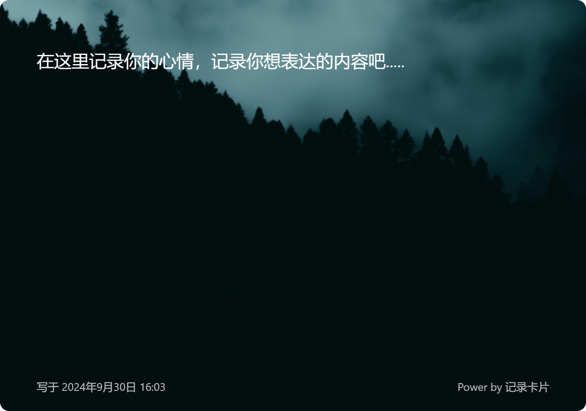
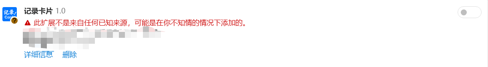

## 记录卡片

#### 一个记录生活，记录心情的卡片。

用途：可以发社交平台，也可以自己记录。（更多用途自己研究）

##### 截图

【内置四种预设背景，可以看效果】：

#### 使用方法：

- **chrome浏览器安装方法**: 到发布页面下载crx文件，打开开发者模式，拖入就可。（不支持chrome浏览器，会无法使用），其他谷歌内核浏览器可以安装（星愿浏览器支持）

- **edge浏览器安装方法**【推荐】：

  1. 到edge加载项页面搜索“记录卡片” ，认准图标**【推荐】**

     

​     2.第二种到发布页面下载crx文件，打开edge开发者选项，直接拖入页面中即可。

#### 打赏我

如果觉得对你有帮助，可以打赏我，感谢您的支持（使用微信扫一扫）

